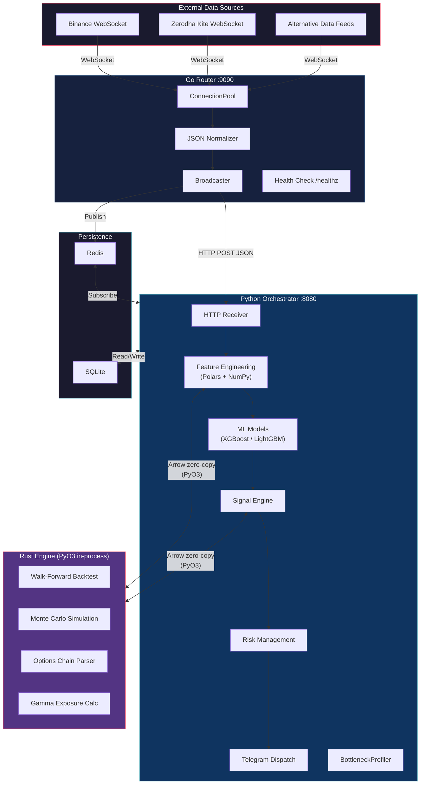
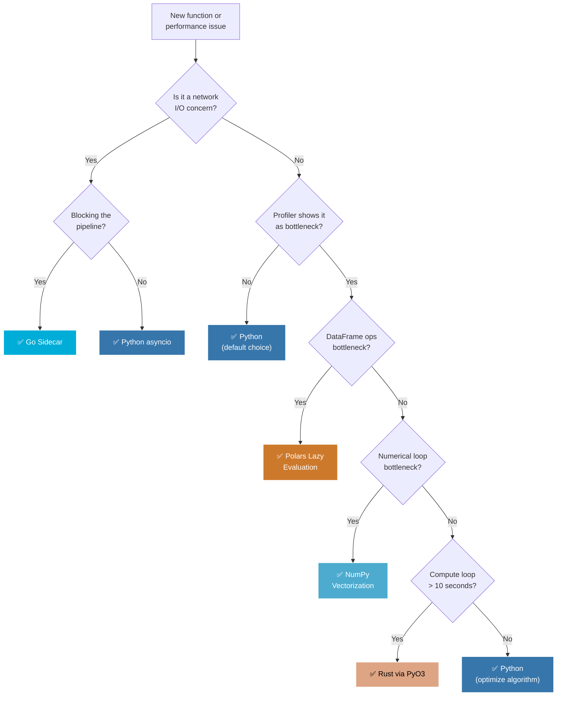

# NEXUS-ASTRA — System Architecture

> **Version:** 1.0  
> **Last Updated:** 2026-06-17  
> **Audience:** Core contributors, DevOps, future maintainers

---

## 1. System Overview

NEXUS-ASTRA is an algorithmic trading system built on a **hybrid three-language architecture**. Each language is chosen for a specific class of workload, and the boundaries between them are deliberately narrow and well-defined.

### 1.1 Python — Orchestrator

Python is the **control plane**. It owns the pipeline lifecycle, ML model training, signal generation, notification dispatch, and persistence.

| Responsibility | Key Libraries / Components |
|---|---|
| Pipeline sequencing | `main_v2.py` with `--mode morning\|afternoon_exit\|night_summary` |
| ML model training | scikit-learn, XGBoost, LightGBM |
| Feature engineering | Polars, NumPy |
| Signal generation | Custom signal engine |
| Risk management | Position sizing, drawdown limits |
| Telegram dispatch | `python-telegram-bot` |
| Persistence | SQLite via `sqlite3` / `sqlalchemy` |
| Profiling | `BottleneckProfiler` (custom) |

> [!NOTE]
> Python is always the **default** choice. Code starts here and only migrates out when profiling proves a bottleneck exists.

### 1.2 Rust — Compute Engine

Rust handles **CPU-bound numerical bottlenecks** that Python cannot serve within latency budgets, even after vectorization. It is built as a [PyO3](https://pyo3.rs/) extension module (`rust_engine`) and is imported seamlessly in Python — no subprocess, no IPC overhead.

| Responsibility | Crate / Technique |
|---|---|
| Walk-forward backtesting | Custom engine, `rayon` for parallelism |
| Monte Carlo simulation | `rand`, `rayon` |
| Options chain parsing | `serde_json`, zero-copy deserialization |
| Gamma exposure (GEX) calculation | `ndarray`, SIMD intrinsics |
| Data exchange | `polars` crate (Arrow zero-copy with Python Polars) |

> [!IMPORTANT]
> Rust code is only introduced when profiling confirms a function is a **top-5 bottleneck** and the expected speedup exceeds **5×**. See the [Migration Guide](./MIGRATION_GUIDE.md) for the full protocol.

### 1.3 Go — Network Router

Go manages **concurrent WebSocket connections** to external data sources. It runs as a **sidecar process**, normalizes incoming data into JSON, and forwards it to the Python pipeline via HTTP POST.

| Responsibility | Package / Pattern |
|---|---|
| Binance WebSocket | `gorilla/websocket`, persistent connection pool |
| Zerodha Kite WebSocket | `gorilla/websocket`, binary frame decoding |
| Alternative data feeds | Pluggable handler architecture |
| Fan-out broadcasting | `Broadcaster` pattern with channel multiplexing |
| Health monitoring | `/healthz` endpoints per feed |

> [!TIP]
> Go is chosen over Python `asyncio` for WebSocket routing because goroutines provide true concurrency with a simpler mental model for connection lifecycle management. Latency is not the driver — **reliability and connection management** are.

---

## 2. Data Flow Diagram



### Data Flow Summary

| Path | Protocol | Format | Latency Sensitivity |
|---|---|---|---|
| External → Go Router | WebSocket | Binary / JSON frames | Medium |
| Go Router → Python | HTTP POST | Normalized JSON | Low (buffered) |
| Go ↔ Redis ↔ Python | Pub/Sub | JSON messages | Low |
| Python ↔ Rust | In-process (PyO3) | Apache Arrow (zero-copy) | High |
| Python ↔ SQLite | Direct | SQL / ORM | Low |
| Python → Telegram | HTTPS | JSON (Bot API) | None |

---

## 3. Language Decision Tree

Use this decision tree when evaluating whether code should stay in Python or be migrated to Rust or Go.



### Decision Rules (in order of evaluation)

| # | Condition | Action |
|---|---|---|
| 1 | Default | Python + Polars + NumPy |
| 2 | Profiler shows DataFrame ops as bottleneck | Switch to Polars lazy evaluation |
| 3 | Profiler shows numerical loop as bottleneck | Apply NumPy vectorization |
| 4 | Profiler shows compute loop > 10 seconds | Migrate to Rust via PyO3 |
| 5 | Profiler shows network I/O blocking pipeline | Move to Go sidecar |

> [!CAUTION]
> **NEVER use C++.** The complexity of build tooling, memory management, and cross-platform compilation outweighs any benefit for a swing/positional trading system. Rust provides equivalent performance with memory safety guarantees and a superior build system.

---

## 4. Data Exchange Protocol

### 4.1 Python ↔ Rust: Apache Arrow (Zero-Copy)

The `rust_engine` crate depends on the `polars` Rust crate, which shares the same Arrow memory layout as the Python `polars` library. DataFrames pass between Python and Rust **without serialization or copying**.

```python
# Python side
import polars as pl
from rust_engine import run_monte_carlo_rs

df = pl.read_parquet("features.parquet")
results = run_monte_carlo_rs(df, n_simulations=10_000)  # Zero-copy round trip
```

```rust
// Rust side (rust_engine/src/lib.rs)
use pyo3::prelude::*;
use polars::prelude::*;
use pyo3_polars::PyDataFrame;

#[pyfunction]
fn run_monte_carlo_rs(py: Python, df: PyDataFrame, n_simulations: usize) -> PyResult<PyDataFrame> {
    py.allow_threads(|| {
        let df = df.into();
        let result = monte_carlo::simulate(&df, n_simulations);
        Ok(PyDataFrame(result))
    })
}
```

### 4.2 Python ↔ Go: JSON over HTTP

Go forwards normalized market data to Python via HTTP POST. Payloads are small (< 10 KB per tick batch), so JSON serialization overhead is negligible. Latency is not critical here — the Go router buffers and batches before forwarding.

```json
{
  "source": "binance",
  "channel": "btcusdt@kline_1m",
  "timestamp": "2026-06-17T16:25:00Z",
  "data": {
    "open": 71234.50,
    "high": 71289.00,
    "low": 71201.30,
    "close": 71256.80,
    "volume": 142.37
  }
}
```

### 4.3 Redis Message Queue

Redis Pub/Sub bridges Go and Python for **event-driven** communication (e.g., connection status changes, feed health alerts). Messages are JSON-encoded with a `type` field for routing.

---

## 5. Build System

All build operations are coordinated through a top-level `Makefile`.

| Command | Description |
|---|---|
| `make build` | Build all components (Python deps, Rust release, Go binary) |
| `make dev` | Development build — Rust in debug mode via `maturin develop` |
| `make test` | Run all test suites (pytest, cargo test, go test) |
| `make profile` | Run `BottleneckProfiler` and generate HTML report |
| `make lint` | Run ruff (Python), clippy (Rust), golangci-lint (Go) |
| `make clean` | Remove all build artifacts |

### Component Build Details

```text
NEXUS-ASTRA/
├── Makefile                    # Top-level orchestrator
├── main_v2.py                  # Python entry point
├── requirements.txt            # Python dependencies
├── rust_engine/
│   ├── Cargo.toml              # Rust workspace config
│   ├── src/lib.rs              # PyO3 module root
│   ├── benchmarks/             # Criterion benchmarks
│   └── pyproject.toml          # maturin config
├── go_router/
│   ├── go.mod                  # Go module config
│   ├── main.go                 # Router entry point
│   └── Dockerfile              # Go sidecar container
├── docker-compose.yml          # Full-stack orchestration
└── .github/workflows/          # CI/CD pipelines
```

---

## 6. Deployment

### 6.1 CI/CD Pipeline

GitHub Actions is the CI/CD platform. The primary pipeline triggers on a **daily schedule** aligned with Indian market hours.

| Trigger | Time | Description |
|---|---|---|
| Scheduled | 06:00 AM IST (00:30 UTC) | Daily pre-market build, test, deploy |
| Push to `main` | On merge | Full build + integration tests |
| Pull request | On open/update | Lint + unit tests only |

### 6.2 Docker Compose Stack

```yaml
# docker-compose.yml (simplified)
services:
  python-orchestrator:
    build: .
    command: python main_v2.py --mode morning
    depends_on: [redis, go-router]
    environment:
      - REDIS_URL=redis://redis:6379
      - GO_ROUTER_URL=http://go-router:9090

  go-router:
    build: ./go_router
    ports:
      - "9090:9090"
    depends_on: [redis]
    environment:
      - REDIS_URL=redis://redis:6379
      - BINANCE_WS_URL=wss://stream.binance.com:9443
      - KITE_API_KEY=${KITE_API_KEY}

  redis:
    image: redis:7-alpine
    ports:
      - "6379:6379"
```

### 6.3 Operational Modes

The Python orchestrator runs in three distinct modes, each triggered at different times:

| Mode | Trigger Time (IST) | Purpose |
|---|---|---|
| `morning` | 06:00 AM | Pre-market analysis, feature generation, signal computation |
| `afternoon_exit` | 03:00 PM | Position exit evaluation, EOD risk assessment |
| `night_summary` | 09:00 PM | Daily P&L, portfolio summary, Telegram report |

---

> [!NOTE]
> For step-by-step guides on migrating Python functions to Rust or adding new WebSocket feeds to the Go router, see [MIGRATION_GUIDE.md](./MIGRATION_GUIDE.md).
