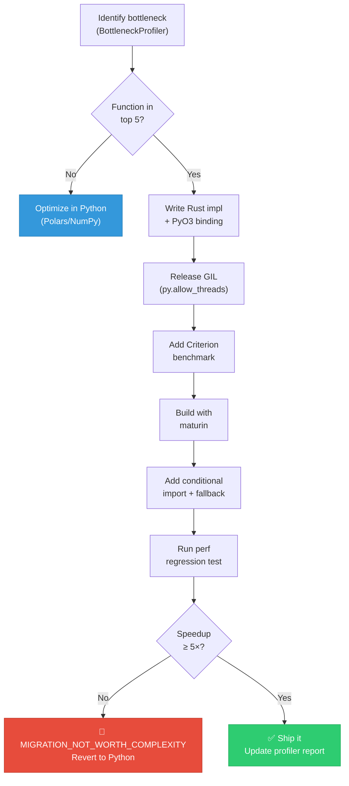

# NEXUS-ASTRA — Migration Guide

> **Version:** 1.0  
> **Last Updated:** 2026-06-17  
> **Prerequisites:** Read [ARCHITECTURE.md](./ARCHITECTURE.md) first  
> **Audience:** Developers migrating performance-critical code between languages

---

## Table of Contents

1. [How to Move a Python Function to Rust](#1-how-to-move-a-python-function-to-rust)
2. [How to Add a New WebSocket Feed to Go Router](#2-how-to-add-a-new-websocket-feed-to-go-router)
3. [Pre-Migration Checklist](#3-pre-migration-checklist)

---

## 1. How to Move a Python Function to Rust

> [!IMPORTANT]
> Only migrate a function if it appears in the **top 5** of the `BottleneckProfiler` report **and** the expected speedup exceeds **5×**. If either condition is not met, optimize the Python implementation first.

### Step 1 — Profile and Confirm the Bottleneck

Run the profiler to identify hot functions:

```python
from profiler import BottleneckProfiler

report = BottleneckProfiler.identify_hot_functions()
report.print_top(n=10)

# Example output:
# ┌────┬──────────────────────────────┬───────────┬────────┐
# │ #  │ Function                     │ Cum. Time │ % Wall │
# ├────┼──────────────────────────────┼───────────┼────────┤
# │  1 │ monte_carlo_simulate()       │   42.3s   │ 38.1%  │
# │  2 │ walk_forward_backtest()      │   28.7s   │ 25.8%  │
# │  3 │ parse_options_chain()        │   12.1s   │ 10.9%  │
# │  4 │ calculate_gex()              │    8.9s   │  8.0%  │
# │  5 │ feature_engineering()        │    6.2s   │  5.6%  │
# └────┴──────────────────────────────┴───────────┴────────┘
```

**Gate:** If your target function is **not** in the top 5, **stop here**. Optimize in Python first (Polars lazy eval, NumPy vectorization).

### Step 2 — Write the Rust Implementation

Create or extend the Rust module in `rust_engine/src/`:

```rust
// rust_engine/src/monte_carlo.rs

use polars::prelude::*;
use rand::prelude::*;
use rayon::prelude::*;

pub fn simulate(df: &DataFrame, n_simulations: usize) -> DataFrame {
    let returns = df.column("daily_return")
        .unwrap()
        .f64()
        .unwrap();

    let results: Vec<f64> = (0..n_simulations)
        .into_par_iter()
        .map(|_| {
            let mut rng = thread_rng();
            let mut portfolio_value = 1_000_000.0;
            for ret in returns.into_iter().flatten() {
                let simulated = ret * rng.gen_range(0.8..1.2);
                portfolio_value *= 1.0 + simulated;
            }
            portfolio_value
        })
        .collect();

    DataFrame::new(vec![
        Series::new("simulation_result".into(), &results),
    ]).unwrap()
}
```

### Step 3 — Add the PyO3 Binding

Expose the function to Python in `rust_engine/src/lib.rs`:

```rust
use pyo3::prelude::*;
use pyo3_polars::PyDataFrame;

mod monte_carlo;

#[pyfunction]
fn run_monte_carlo_rs(py: Python, df: PyDataFrame, n_simulations: usize) -> PyResult<PyDataFrame> {
    // Step 4: Release the GIL for long computations
    py.allow_threads(|| {
        let df: polars::prelude::DataFrame = df.into();
        let result = monte_carlo::simulate(&df, n_simulations);
        Ok(PyDataFrame(result))
    })
}

#[pymodule]
fn rust_engine(_py: Python, m: &PyModule) -> PyResult<()> {
    m.add_function(wrap_pyfunction!(run_monte_carlo_rs, m)?)?;
    Ok(())
}
```

### Step 4 — Release the GIL

> [!WARNING]
> If you forget `py.allow_threads()`, the Rust function will hold the GIL for its entire execution, blocking all Python threads. This negates much of the concurrency benefit.

Wrap all long-running computations in `py.allow_threads(|| { ... })` as shown in Step 3. This allows Python threads to continue executing while Rust does its work.

### Step 5 — Add a Criterion Benchmark

Create a benchmark in `rust_engine/benchmarks/`:

```rust
// rust_engine/benchmarks/monte_carlo_bench.rs

use criterion::{black_box, criterion_group, criterion_main, Criterion};
use polars::prelude::*;

fn bench_monte_carlo(c: &mut Criterion) {
    let df = DataFrame::new(vec![
        Series::new("daily_return".into(), &vec![0.01_f64; 252]),
    ]).unwrap();

    c.bench_function("monte_carlo_10k", |b| {
        b.iter(|| {
            rust_engine::monte_carlo::simulate(black_box(&df), black_box(10_000))
        })
    });
}

criterion_group!(benches, bench_monte_carlo);
criterion_main!(benches);
```

Run the benchmark:

```bash
cd rust_engine
cargo bench
```

### Step 6 — Build the Extension Module

**Development** (fast iteration, debug symbols):

```bash
cd rust_engine
maturin develop
```

**Production** (optimized, stripped):

```bash
cd rust_engine
maturin build --release
pip install target/wheels/rust_engine-*.whl
```

Or use the top-level Makefile:

```bash
make dev    # maturin develop
make build  # maturin build --release
```

### Step 7 — Add Conditional Import with Python Fallback

In your Python module, always provide a fallback so the system works even without the Rust extension:

```python
# engine/monte_carlo.py

import polars as pl

def monte_carlo_simulate_py(df: pl.DataFrame, n_simulations: int = 10_000) -> pl.DataFrame:
    """Pure Python fallback — slower but always available."""
    import numpy as np
    returns = df["daily_return"].to_numpy()
    results = []
    for _ in range(n_simulations):
        noise = np.random.uniform(0.8, 1.2, size=len(returns))
        simulated = returns * noise
        portfolio = 1_000_000.0 * np.prod(1 + simulated)
        results.append(portfolio)
    return pl.DataFrame({"simulation_result": results})


# Conditional import — Rust preferred, Python fallback
try:
    from rust_engine import run_monte_carlo_rs as monte_carlo_simulate
    _USING_RUST = True
except ImportError:
    monte_carlo_simulate = monte_carlo_simulate_py
    _USING_RUST = False

import logging
logger = logging.getLogger(__name__)
logger.info(f"Monte Carlo engine: {'Rust (rust_engine)' if _USING_RUST else 'Python (fallback)'}")
```

> [!TIP]
> Log which implementation is active at startup. This makes debugging performance regressions trivial — check the logs first.

### Step 8 — Run Performance Regression Test

```python
from profiler import PerformanceRegressionTest

result = PerformanceRegressionTest.compare(
    baseline_fn=monte_carlo_simulate_py,
    optimized_fn=monte_carlo_simulate,
    test_data=load_test_fixture("features_252d.parquet"),
    n_runs=5,
)

print(result)
# ┌──────────────┬───────────┬───────────┬──────────┐
# │ Impl         │ Mean (s)  │ Std (s)   │ Speedup  │
# ├──────────────┼───────────┼───────────┼──────────┤
# │ Python       │   42.31   │   1.24    │ 1.0×     │
# │ Rust (PyO3)  │    1.87   │   0.09    │ 22.6×    │
# └──────────────┴───────────┴───────────┴──────────┘
# ✅ MIGRATION_WORTH_COMPLEXITY (speedup 22.6× > 5× threshold)
```

> [!CAUTION]
> If the speedup is **< 5×**, the migration is flagged as `MIGRATION_NOT_WORTH_COMPLEXITY`. Revert to the Python implementation and investigate algorithmic improvements instead. The maintenance burden of a second language must be justified by significant performance gains.

### Step 9 — Update Profiler Report

Re-run the profiler to confirm the bottleneck is resolved:

```python
report = BottleneckProfiler.identify_hot_functions()
report.print_top(n=10)

# Verify: monte_carlo_simulate() should no longer appear in the top 5
# If it does, investigate — the Rust implementation may have a bug or
# the data path may still be hitting the Python fallback.
```

### Migration Flowchart



---

## 2. How to Add a New WebSocket Feed to Go Router

Use this guide when adding a new real-time data source (e.g., a new exchange, an alternative data provider) to the Go router sidecar.

### Step 1 — Add a New Route

In `go_router/main.go`, register the new feed in the router setup:

```go
// go_router/main.go

func setupRoutes(mux *http.ServeMux, broadcaster *Broadcaster, pool *ConnectionPool) {
    // Existing routes
    mux.HandleFunc("/ws/binance", handleBinance(broadcaster, pool))
    mux.HandleFunc("/ws/kite", handleKite(broadcaster, pool))

    // NEW: Add your feed
    mux.HandleFunc("/ws/newexchange", handleNewExchange(broadcaster, pool))

    // Health check routes
    mux.HandleFunc("/healthz/binance", healthBinance(pool))
    mux.HandleFunc("/healthz/kite", healthKite(pool))
    mux.HandleFunc("/healthz/newexchange", healthNewExchange(pool))  // NEW
}
```

### Step 2 — Implement the Connection Handler

Create a handler that uses the `ConnectionPool` for managed connections with automatic reconnection:

```go
// go_router/handlers/newexchange.go

package handlers

import (
    "encoding/json"
    "log"
    "time"

    "github.com/gorilla/websocket"
)

func handleNewExchange(broadcaster *Broadcaster, pool *ConnectionPool) http.HandlerFunc {
    return func(w http.ResponseWriter, r *http.Request) {
        conn, err := pool.Acquire("newexchange", ConnectionConfig{
            URL:              os.Getenv("NEWEXCHANGE_WS_URL"),
            ReconnectBackoff: 5 * time.Second,
            MaxRetries:       10,
            PingInterval:     30 * time.Second,
        })
        if err != nil {
            log.Printf("ERROR: Failed to connect to NewExchange: %v", err)
            http.Error(w, "connection failed", http.StatusBadGateway)
            return
        }
        defer pool.Release("newexchange", conn)

        for {
            _, message, err := conn.ReadMessage()
            if err != nil {
                log.Printf("ERROR: NewExchange read error: %v", err)
                return
            }

            // Step 3: Normalize the message
            normalized, err := normalizeNewExchange(message)
            if err != nil {
                log.Printf("WARN: Skipping malformed message: %v", err)
                continue
            }

            // Step 4: Broadcast to all subscribers
            broadcaster.Publish("newexchange", normalized)
        }
    }
}
```

### Step 3 — Define JSON Normalization Schema

All feeds must normalize to a common JSON schema before broadcasting:

```go
// go_router/normalizers/newexchange.go

type NormalizedTick struct {
    Source    string    `json:"source"`
    Channel  string    `json:"channel"`
    Timestamp time.Time `json:"timestamp"`
    Data     TickData  `json:"data"`
}

type TickData struct {
    Open   float64 `json:"open"`
    High   float64 `json:"high"`
    Low    float64 `json:"low"`
    Close  float64 `json:"close"`
    Volume float64 `json:"volume"`
}

func normalizeNewExchange(raw []byte) (NormalizedTick, error) {
    var msg NewExchangeRawMessage
    if err := json.Unmarshal(raw, &msg); err != nil {
        return NormalizedTick{}, fmt.Errorf("unmarshal error: %w", err)
    }

    return NormalizedTick{
        Source:    "newexchange",
        Channel:  msg.Symbol,
        Timestamp: time.UnixMilli(msg.EventTime),
        Data: TickData{
            Open:   msg.Kline.Open,
            High:   msg.Kline.High,
            Low:    msg.Kline.Low,
            Close:  msg.Kline.Close,
            Volume: msg.Kline.Volume,
        },
    }, nil
}
```

### Step 4 — Register with Broadcaster

The `Broadcaster` handles fan-out to all subscribers (including the HTTP POST to Python):

```go
// In your handler setup or main.go
broadcaster.RegisterSource("newexchange", BroadcastConfig{
    // Forward to Python orchestrator
    HTTPTarget:   "http://python-orchestrator:8080/ingest/newexchange",
    RedisChannel: "feed:newexchange",
    BatchSize:    10,             // Batch 10 ticks before forwarding
    FlushInterval: 1 * time.Second, // Or flush every second, whichever comes first
})
```

### Step 5 — Add Health Check Endpoint

```go
// go_router/health/newexchange.go

func healthNewExchange(pool *ConnectionPool) http.HandlerFunc {
    return func(w http.ResponseWriter, r *http.Request) {
        status := pool.Status("newexchange")
        resp := HealthResponse{
            Feed:          "newexchange",
            Connected:     status.Connected,
            LastMessage:   status.LastMessageTime,
            MessageCount:  status.MessageCount,
            Uptime:        time.Since(status.ConnectedAt).String(),
        }

        w.Header().Set("Content-Type", "application/json")
        if !status.Connected {
            w.WriteHeader(http.StatusServiceUnavailable)
        }
        json.NewEncoder(w).Encode(resp)
    }
}
```

### Step 6 — Add Python Receiver Endpoint

In `main_v2.py`, register the receiver for the new feed:

```python
# main_v2.py (or wherever your HTTP server routes are defined)

@app.post("/ingest/newexchange")
async def ingest_newexchange(payload: dict):
    """Receive normalized tick data from Go router."""
    logger.debug(f"Received {payload['source']} tick: {payload['channel']}")

    # Store in feature pipeline buffer
    feature_pipeline.ingest(
        source=payload["source"],
        channel=payload["channel"],
        timestamp=payload["timestamp"],
        data=payload["data"],
    )

    return {"status": "ok"}
```

### Step 7 — Update docker-compose.yml

Add any new environment variables needed by the Go router:

```yaml
# docker-compose.yml
services:
  go-router:
    build: ./go_router
    ports:
      - "9090:9090"
    environment:
      - REDIS_URL=redis://redis:6379
      - BINANCE_WS_URL=wss://stream.binance.com:9443
      - KITE_API_KEY=${KITE_API_KEY}
      - NEWEXCHANGE_WS_URL=${NEWEXCHANGE_WS_URL}    # <-- NEW
      - NEWEXCHANGE_API_KEY=${NEWEXCHANGE_API_KEY}  # <-- NEW (if required)
```

Add the new secrets to your `.env` file and CI/CD secrets store.

### WebSocket Feed Addition Flowchart


---

## 3. Pre-Migration Checklist

Before migrating **any** function from Python to Rust or adding a new Go component, every item on this checklist must be satisfied.

### For Python → Rust Migration

- [ ] **Profiler report proves function is a top-5 bottleneck**
  - Run `BottleneckProfiler.identify_hot_functions()` and attach the report to your PR
  - The function must appear in positions 1–5 of the ranked output

- [ ] **Python fallback exists and is tested**
  - The original Python implementation must remain as a fallback
  - Unit tests must pass against both the Python and Rust implementations
  - Conditional import pattern is used (see [Step 7](#step-7--add-conditional-import-with-python-fallback))

- [ ] **Benchmark shows > 5× speedup**
  - Run `PerformanceRegressionTest.compare()` with at least 5 runs
  - Speedup must exceed 5× to justify the added complexity
  - Attach benchmark results to your PR

- [ ] **No premature optimization flag**
  - Run `enforce_no_premature_optimization()` — it must not raise
  - This guard checks that you haven't skipped Python-level optimizations (Polars lazy, NumPy vectorization) before jumping to Rust

- [ ] **CI pipeline updated to build the Rust component**
  - GitHub Actions workflow includes `maturin build --release`
  - Cargo tests run as part of the CI pipeline
  - The Rust wheel is included in the Docker image build

### For Adding a Go WebSocket Feed

- [ ] **Feed specification documented**
  - WebSocket URL, authentication method, and message format are documented
  - Normalization mapping to the standard JSON schema is defined

- [ ] **Connection handler uses `ConnectionPool`**
  - Automatic reconnection with exponential backoff
  - Ping/pong heartbeat configured

- [ ] **Health check endpoint added**
  - `/healthz/feedname` returns connection status, last message time, and uptime
  - Returns HTTP 503 when disconnected

- [ ] **Python receiver registered**
  - Endpoint in `main_v2.py` accepts and buffers the normalized data
  - Integration test covers end-to-end flow

- [ ] **docker-compose.yml updated**
  - New environment variables added
  - Secrets stored in `.env` and CI secrets store

---

## Quick Reference

| Task | Command |
|---|---|
| Profile bottlenecks | `python -c "from profiler import BottleneckProfiler; BottleneckProfiler.identify_hot_functions().print_top()"` |
| Build Rust (dev) | `cd rust_engine && maturin develop` |
| Build Rust (release) | `cd rust_engine && maturin build --release` |
| Run Rust benchmarks | `cd rust_engine && cargo bench` |
| Run Rust tests | `cd rust_engine && cargo test` |
| Build Go router | `cd go_router && go build -o go_router .` |
| Run Go tests | `cd go_router && go test ./...` |
| Full build (all languages) | `make build` |
| Full test suite | `make test` |
| Check Go feed health | `curl http://localhost:9090/healthz/binance` |

---

> [!NOTE]
> This guide will evolve as new patterns emerge. When you complete a migration, update this document with any lessons learned. See [ARCHITECTURE.md](./ARCHITECTURE.md) for the full system design.
